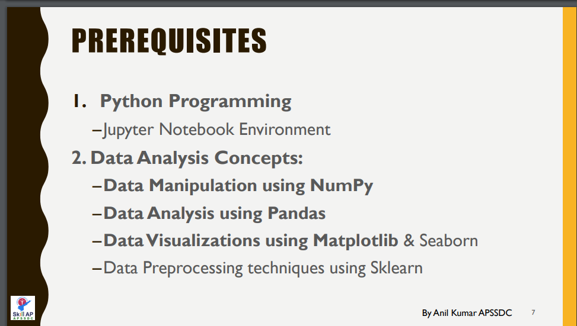

# Machine-Learning-Using-Python

This repository consists of all the files, resources, and recorded session links which are discussed during Machine Learning using Python Online Training.
<!---
#### Check your details here same will applicable on certificates if your details are missing update in last column  → [[GSheet]]()

#### Gotomeeting Link → [[Click Here to Join]](meetingLink) → Meeting Id → 
--->

#### 

#### APSSDC-ML-Datasets → [[Click Here]](https://github.com/AP-State-Skill-Development-Corporation/Datasets)

#### Few resources avaliable @ [[resources.md]](resources.md) file don't forget to use them

### Instructions for attendance

Everyone should compulsory follow the below instruction in order to get the attendance --> Certificate

1. Login format **`rollnumber-name-college`**
2. Don't give spaces in roll number or shorcut of your roll number
3. Don't give spaces between rollnumber and name (only - single minus or hyphen character)
4. Make sure roll number should match with the registered roll number
5. Required attendance minimum **120 minutes out of 150 minutes** session

<!-----
******************************
Reference purpose follow this below things

1. Commit message format
- For content updation -- Added dayNo discussed content
-For Readme.md file updation --  Updated dayNo content
-For resources.md file updation --  Updated resourceName

2.README.md content

DayNo SampleLessonName (Date)

Discussed Concepts:
1. Topic-1
2. Topic-2

[[DayNo_Notebook_Link]]()
[[DayNo_Recorded_Video_Link]]()
*************************
--->

### Day1 Introduction to Machine Learning (26/Oct/2020)

Discussed Concepts:
1. What is machine Learning
2. Types of ML
3. Applications
4. Algorithms  

* [ML pdf ](Day-1/MachineLearningwithPython.pdf)
* [Anaconda installation pdf](Day-1/AnacondaInstallation.pdf)
* [Notebook](Day-1/01_Day1_26Oct2020.ipynb)
* [Notes.txt](Day-1/Notes.txt)
* [salary.csv](Day-1/salary.csv)
* [Recorded Video](https://transcripts.gotomeeting.com/#/s/573f1e450dda4fb0e611545ee4b158e6afe2bf0073d790a71a2b4d00689857c6)
